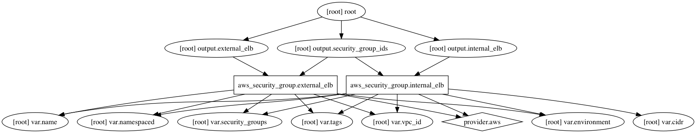

AWS Security Groups Terraform Module
=====================

Creates basic security groups to be used by instances and ELBs.

Usage:
------

    module "security_group" {
      source      = "../tf_security_groups"

      add variables
    }

## Inputs

| Name | Description | Default | Required |
|------|-------------|:-----:|:-----:|
| cidr | The cidr block to use for internal security groups | - | yes |
| environment | Environment (ex: dev, qa, stage, prod) | - | yes |
| name | Name | - | yes |
| namespaced | Namespace all resources (prefixed with the environment)? | `true` | no |
| security_groups | Comma separated list of security groups | - | yes |
| tags | A map of tags to add to all resources | `<map>` | no |
| vpc_id | The VPC ID | - | yes |

## Outputs

| Name | Description |
|------|-------------|
| external_elb | External ELB allows traffic from the world. |
| internal_elb | /* // External SSH allows ssh connections on port 22 from the world. output "external_ssh" {   value = "${aws_security_group.external_ssh.id}" } */ /* // Internal SSH allows ssh connections from the external ssh security group. output "internal_ssh" {   value = "${aws_security_group.internal_ssh.id}" } */ Internal ELB allows internal traffic. |
| security_group_ids | Security Groups defined |

### Resource Graph

